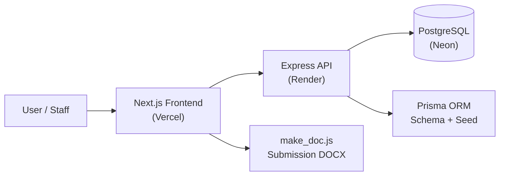

# HAQMS

Hospital Appointment & Queue Management System.

HAQMS is a polished full-stack hospital workflow app built to feel like a real operations dashboard, not a classroom toy. It combines a public queue board, staff login, patient records, doctor views, appointment flows, and production deployment fixes into one submission-ready project.

<p align="center">
	
	
	
	
</p>

<p align="center">
	Built to look and feel like a real hospital operations system with realistic demo data, cleaner UI, deploy fixes, and a submission-ready workflow.
</p>

## What This Project Proves

- Realistic hospital demo data with seeded staff, patients, appointments, and queue tokens.
- A cleaner, production-style UI for the landing page, queue board, dashboard, login, and 404 state.
- Safer backend behavior with clearer API errors, proxy-aware server config, and deploy-friendly defaults.
- End-to-end deployment readiness for Render, Vercel, Prisma, and PostgreSQL.

## Live Stack

- Frontend: Next.js App Router
- Backend: Node.js + Express
- Database: PostgreSQL
- ORM: Prisma
- Deployment: Vercel frontend + Render backend

## Architecture At A Glance



## Highlights Added For Submission

- Realistic seed data instead of placeholder names and toy examples.
- Better public-facing queue snapshot and operational tiles.
- Staff dashboard copy rewritten to sound like a real product.
- Login flow hardened so HTML error pages do not crash JSON parsing.
- Render deployment fixes, including proxy trust and correct API base handling.
- Prisma migrations and seeding verified against the remote Neon database.
- Submission documentation and report generation support through `make_doc.js`.

## Demo Credentials

All seeded accounts use the same password:

```text
password123
```

| Role | Email | Best For |
|---|---|---|
| Administrator | admin@haqms.com | Reports, oversight, and full-system access |
| Receptionist | reception1@haqms.com | Registration, scheduling, and queue handling |
| Doctor | doctor1@haqms.com | Daily worklist, patient review, and calling workflow |

## Quick Start

### 1) Install dependencies

```bash
npm run install:all
```

### 2) Start the database

If you want a local PostgreSQL container:

```bash
npm run docker:db
```

Or point the backend at your own PostgreSQL instance by setting `DATABASE_URL` in `backend/.env`.

### 3) Prepare the backend database

```bash
npm run db:setup --prefix backend
```

### 4) Run the app locally

```bash
npm run dev
```

That starts the backend on port `5000` and the frontend on port `3000`.

## Useful Commands

```bash
npm run dev:backend
npm run dev:frontend
node make_doc.js
```

## Project Story

This repository was refined into a realistic demo of how a hospital queue system should look and behave under pressure: clean data, believable workflow, clear errors, and a deployable stack. The final result is meant to stand out in a review because it reads like a completed product, not just a code sample.
